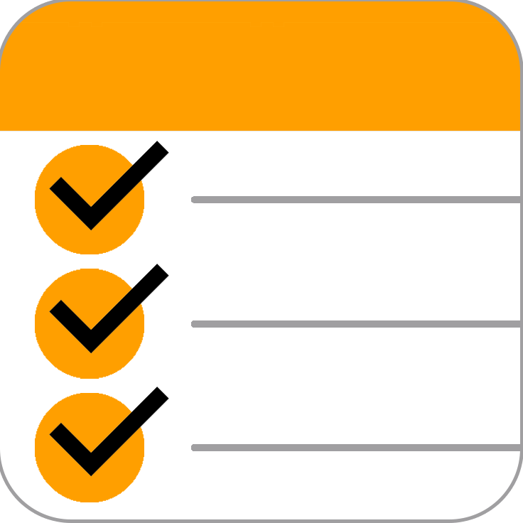

# Mi Shopping List

### This is the official Mi Shopping List support website.
- You can read the privacy policy here: [Privacy Policy](https://mishoppinglist.github.io/Privacy-Policy/).
- You can also read our Terms and Conditions here: [Terms and Conditions](https://mishoppinglist.github.io/Terms-and-Conditions/)
- Contact me here as wel, at <mishoppinglist@outlook.com>.

#### Developer Info
This iOS App is created by **Giordano Menegazzi**, an individual **iOS Developer** from the Netherlands. 

- [LinkedIn](https://www.linkedin.com/in/giordano-menegazzi-35108012a/)

- [iOS Portfolio](https://giordano-menegazzi.github.io/)

#### App Background
At first the App was designed for personal use only, because I needed an app exactly like this myself... I tried multiple different other "similar" apps but was always missing some kind functionality, so I desided to create my own... Eventually I'm so happy with the result I believe other people could use this app as well, so it's made publicly available for everyone to use ;)

Obviously it takes a lot of work to built an app like this, especially for a standalone **iOS Developer** like me, so any feedback would be welcome!

In the near future I'm planning on integrating an option for a premium account as well, so you can decide to buy premium and support me for my hard work. 

Next to that I'm also planning on integrating cloudKit support as well, so you can share it with your friends and family and both edit the shared list's at the same time!
This obviously takes some time and effort to implement, but it's in the pipeline so hang on ;)

If you got other suggestions for new features or found an bugs in the app, please don't hesitate to contact me at <mishoppinglist@outlook.com>.

## I hope you enjoy the App!

Greetings,

**Giordano Menegazzi**

