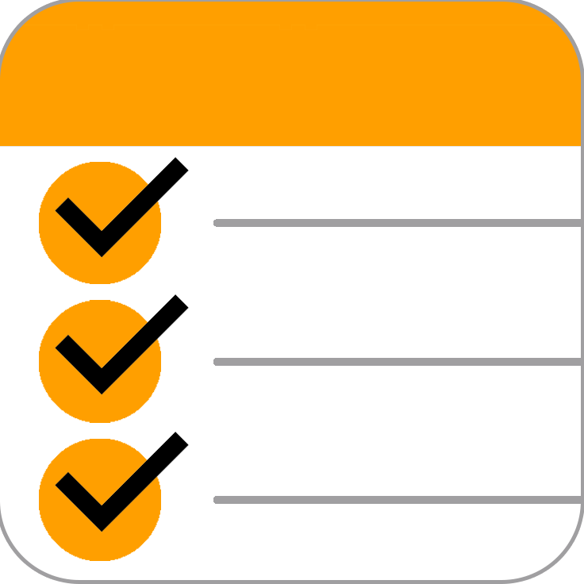

# Mi Shopping List

{:height="200px" width="200px"}
###### iOS App

### This is the official Mi Shopping List support website.
- You can read the privacy policy here: [Privacy Policy](https://mishoppinglist.github.io/Privacy-Policy/).
- Contact me here as wel, at <mishoppinglist@outlook.com>.

#### Developer Info
This iOS App is created by **Giordano Menegazzi**, an individual **iOS Developer** from the Netherlands. 

- [LinkedIn](https://www.linkedin.com/in/giordano-menegazzi-35108012a/)

#### App Background
At first the App was designed for personal use only, because i needed an app exactly like this myself... I tried multiple different other "similar" apps but was always missing some kind functionality, so i desided to create my own... Eventually i'm so happy with the result i believe other people could use this app as well, so it's made publicly available for everyone to use.

Obviously it takes some work to built an app like this especially for a standalone **iOS Developer** like me, so i implemented **Google AdMob** to generate somewhat of an income from it. 

In the near future i'm planning on integrating an option for a premium account as well, so you can decide to buy premium and stop seeing these advertisements or keep using as is. 

Next to that i'm also planning on integrating cloudKit support as well, so you can share it with friends and family and both edit the shared list at the same time.
This obviously takes some time and effort to implement, but it's in the pipeline so hang on ))

If you got other suggestions for new features or found any bugs in the app please don't hesitate to contact me at <mishoppinglist@outlook.com>.

## I hope you enjoy the App!

Greetings,

**Giordano Menegazzi**

